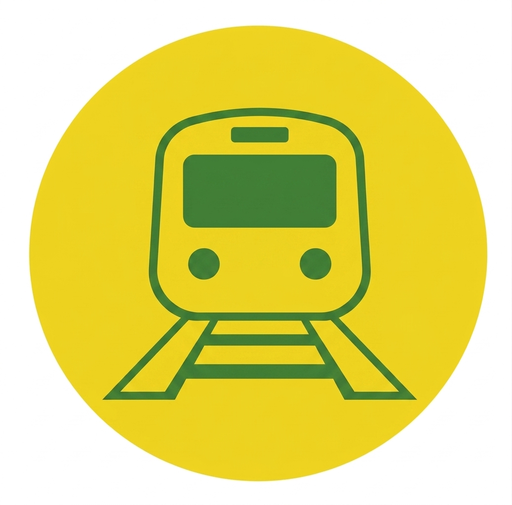

# Berlin Transit Alert

A service that detects delays and disruptions on Berlin public transportation lines and instantly notifies users via Telegram — no manual checking required.

## What it does

- Users subscribe to U-Bahn and S-Bahn lines through a Telegram bot
- A crawler runs every 10 minutes, scraping the BVG and S-Bahn Berlin websites for disruptions
- When a disruption is detected, subscribed users receive a Telegram notification within 10 minutes
- A public web dashboard shows the current status of all lines at a glance

## Tech stack

| Layer         | Technology                             |
| ------------- | -------------------------------------- |
| Monorepo      | Turborepo + pnpm workspaces            |
| Backend       | NestJS (`apps/api`)                    |
| Frontend      | Next.js (`apps/web`) — _coming soon_   |
| Database      | Supabase (PostgreSQL)                  |
| Crawler       | Playwright (scheduled via NestJS cron) |
| Notifications | Telegram Bot API via `nestjs-telegraf` |
| Hosting       | AWS EC2 t3.micro, Nginx, PM2           |
| CI/CD         | GitHub Actions → EC2                   |

## Telegram bot commands

| Command          | Description                                     |
| ---------------- | ----------------------------------------------- |
| `/start`         | Welcome message and onboarding instructions     |
| `/add [line]`    | Subscribe to a line (e.g. `/add U8`, `/add S1`) |
| `/remove [line]` | Unsubscribe from a line                         |
| `/mylines`       | Show your currently subscribed lines            |
| `/status`        | Show current status of your subscribed lines    |

**Notification example:**

> ⚠️ _U8 — Delay_
>
> Delays of approx. 10 minutes due to a signal failure near Hermannstraße.
>
> _Updated: 08:42_

## Project structure

```
berlin-transit-alert/
├── apps/
│   └── api/          # NestJS backend (crawler, bot, notifications)
├── docs/
│   └── specs/        # Implementation specs per feature
├── prd.md            # Product requirements
└── turbo.json
```

## Local development

**Prerequisites:** Node.js 20+, pnpm, a Supabase project, a Telegram bot token

```bash
# Install dependencies
pnpm install

# Copy and fill in environment variables
cp apps/api/.env.example apps/api/.env

# Start the API in watch mode
pnpm dev
```

**Required env vars** (in `apps/api/.env`):

```env
TELEGRAM_BOT_TOKEN=
SUPABASE_URL=
SUPABASE_SERVICE_ROLE_KEY=
```

## Data sources

- **U-Bahn / Bus / Tram:** [bvg.de](https://www.bvg.de)
- **S-Bahn:** [s-bahn-berlin.de](https://www.s-bahn-berlin.de)

MVP scope covers U-Bahn and S-Bahn only.

## Docs

Implementation specs live in [docs/specs/](docs/specs/). See [prd.md](prd.md) for the full product requirements and implementation checklist.
